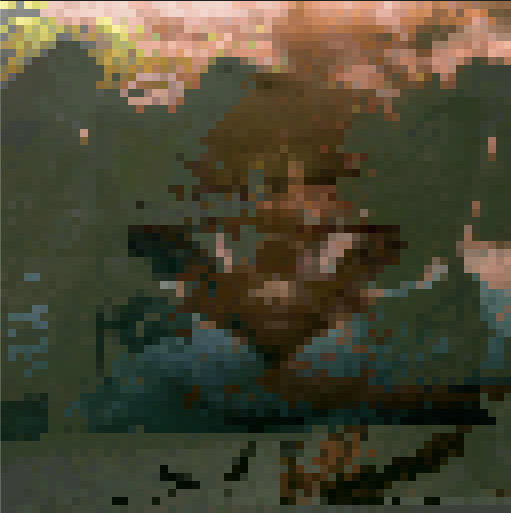

# Pixel Morph

<table>
  <tr>
    <th>Source</th>
    <th></th>
    <th>Target</th>
  </tr>
  <tr>
    <td></td>
    <td align="center">→</td>
    <td></td>
  </tr>
</table>

## Result

  

It needs a bit of work.

